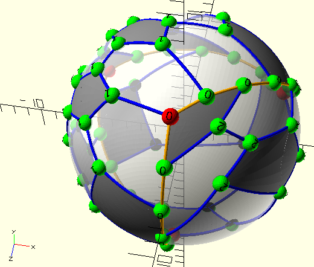

I have problems with OpenJSCAD, but I found joostn's github pages working:  
http://joostn.github.io/OpenJsCad/

From the repo  
https://github.com/joostn/openjscad/tree/gh-pages
I extracted the .zip in accordance with LICENSE:
https://github.com/joostn/OpenJsCad/archive/refs/heads/gh-pages.zip

Opening  [OpenJsCad-gh-pages/index.html](OpenJsCad-gh-pages/index.html) (locally) in browser has working model viewer, and its Playground works as well.   

This is basis to investigate whether I can use this (old/deprecated) OpenJSCAD version to produce same output in browser ...  
  

... that I create with planar graph playground as OpenSCAD file:  
[https://github.com/Hermann-SW/planar_graph_playground/blob/main/node.tetra.js](https://github.com/Hermann-SW/planar_graph_playground/blob/main/node.tetra.js)

[OpenJsCad-gh-pages/only_viewer.html](OpenJsCad-gh-pages/only_viewer.html) is stripped down version of index.html with only viewer showing its .jscad file:  

# DEPRECATED!

This repository is not maintained anymore but left here for archive purposes. Please go to:
https://github.com/jscad/OpenJSCAD.org

You may have some old .jscad files which must be parsed with my original jscad parser which can be found here:
http://joostn.github.io/OpenJsCad/

# License

Copyright (c) 2012 Joost Nieuwenhuijse (joost@newhouse.nl), under the [MIT license](http://www.opensource.org/licenses/mit-license.php).
Copyright (c) 2011 Evan Wallace (http://madebyevan.com/), under the [MIT license](http://www.opensource.org/licenses/mit-license.php).
